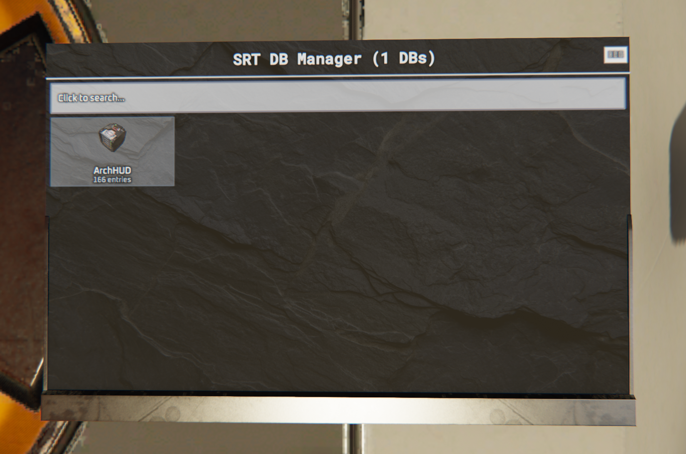

# DB Manager

A Programming Board + screen script for managing multiple in-game Data Bank
elements from a single searchable UI.



## Features

- Auto-detects up to 10 linked `DataBankUnit`s and 1 `ScreenUnit` — no slot
  naming required.
- Card-grid overview of every connected databank (name, entry count, icon).
- Search across all databanks' keys and values at once.
- View, add, edit, and delete individual key/value entries per databank.
- Clone a whole databank, or just selected entries, from one databank to
  any number of others.
- Boot-time "N Databanks connected — Loading Data" indicator (with spinner)
  instead of a blank/stale screen while the full dataset streams in.
- Data is pushed from the Programming Board to the screen in small chunks
  (avoids the per-message size limit) rather than sent all at once.

## Export Parameters

| Parameter    | Type   | Default                          | Description                          |
|--------------|--------|-----------------------------------|---------------------------------------|
| `HideWidget` | bool   | `true`                            | Hides the PB's in-world widget icon.  |
| `BGImageUrl` | string | (bundled slate texture URL)       | Background image shown on the screen. |

## Installation

1. Place a Programming Board and link:
   - 1 Screen Unit
   - Up to 10 Data Bank units
   (any link slot — elements are detected by class, not slot name)
2. Open the Programming Board's Lua editor and paste in the full contents
   of [`DBManager_PB_FULL.txt`](DBManager_PB_FULL.txt).
3. Power on the Programming Board. The screen will show the connected
   databank count immediately, then populate with data.

## Development

`DBManager_PB_FULL.txt` is a generated file — do not hand-edit it. Source
lives in `DBManager_OnStart.txt` (control unit logic) and
`DBManager_Screen.txt` (screen render script). After editing either, rebuild
with:

```
python3 build_pb.py
```
